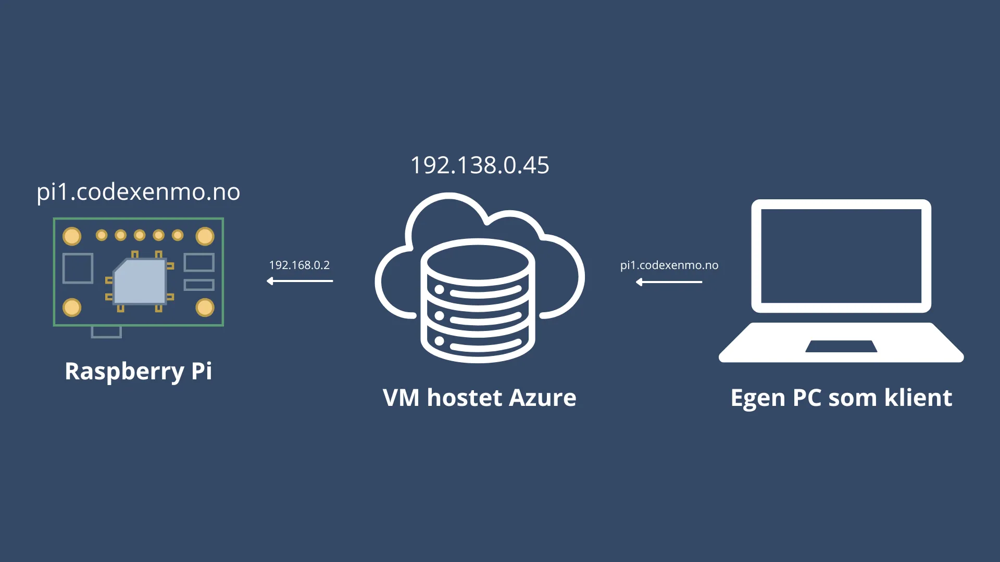

### Overordnet beskrivelse av casen

Vi distribuerer programvaren på Raspberry Pi-enheter som installeres på anlegg med batterier, solceller og invertere. Per i dag har vi flere Raspberry Pi-er plassert rundt i Norge, men er begrenset i vår mulighet til å få tilgang til nettsiden/dashbordet som blir hostet lokalt på enheten. Vi ønsker å sette opp en tjeneste som gjør det mulig å automatisk sette opp en custom URL for hver Raspberry Pi, slik at det blir mulig å åpne opp dashbordet hvor som helst i verden over internett. Med utstyret studentene får utdelt vil de først demonstrere at de klarer å få tilgang til sin Raspberry Pi gjennom et unikt domene. Deretter vil studentene utvikle et grensesnitt for å vise de ulike enhetene som er koblet til serveren.pyth

### **Ressurser:**

- 1 Raspberry Pi
- Tilkobling til ruter
    - SSID: `vilduhajobb`
    - Passord: `jamenkunienmo!`
- API-nøkler for dynamisk DNS
    - Skal registreres under domenet: codexenmo.no
- 1 Virtual Machine hostet hos Azure Cloud

### **Delmål**

<aside>
💡

Punktene som er markert med stjerne er bonusoppgaver.

</aside>

**Mål 1 - Raspberry Pi på nett**

- Få tilgang til Raspberry Pi gjennom VM
- Unikt domene for RPi (Tips: Dynamisk DNS)
- Lagre informasjon om RPi på VM
- Mulighet for å hente informasjon om tilkoblingen fra VM

**Mål 2 - Utvikle grensesnitt:**

- Vise tilkoblede enheter
- Vise noe data om hver enhet

⭐ Innlogging, eksempelvis gjennom Google

⭐ Legge inn lagring med tidsstempler, kan brukes til:

- Å vise historikk
- Å vise endringer over tid

### **Vurderingskriterier**

**Dere vurderes på:**

- Om løsningen løser alle mål
- Skalerbarhet, skal være “enkelt” å gå fra 1 RPi til 100
- Innsats over fint grensesnitt
- Forståelse av oppgaven
- Brukervennlig grensesnitt

### Ressurser

- For begrepsforklaring, se: [Ordliste](https://www.notion.so/Ordliste-129ccf1e226080eda127e40de9cfd120?pvs=21)
- For informasjon om VM, se: [VM](https://www.notion.so/VM-129ccf1e22608046941cdb2dd13de297?pvs=21)
- For informasjon om DNS, se: [DNS](https://www.notion.so/DNS-129ccf1e226080fb9e25e9145c4ec280?pvs=21)
- For informasjon om Raspberry Pi, se: [Raspberry Pi](https://www.notion.so/Raspberry-Pi-129ccf1e226080e280d3e25a4134b94d?pvs=21)